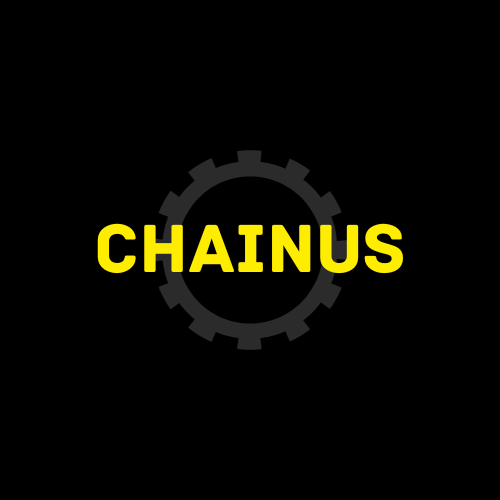

<div align="center">

<h1 align="center">Chainus </h1>
</div>
<br>
Chainus is an easy-to-use, vanilla JavaScript-friendly, reactive, lightweight, and functional SPA (Single Page Application) framework.

##### Minified Size of Latest Update (0.1.0): 10,6kb

## Features

- **Component-Based:** Supports modular and reusable components.
- **Props and Slots:** Allows data transmission and content placement between components.
- **Data Provider:** Stands out with data retrieval and management capabilities.
- **State and Store Management:** Facilitates application state and global data management.

## Installation

### CDN

You can include Chainus directly from the CDN:

- Minified Module Version:
    ```js
    import {
      html,
      Mount,
      state,
      setComponent,
      createElement,
      async,
      createId,
      createStore,
      onConnect,
      onRemove
    } from "https://unpkg.com/chainus/src/chainus.min.mjs";
    ```

- Portable Version

    ```html
    <script src="https://unpkg.com/chainus/src/chainus.min.js">
    ```

## NPM

Install Chainus using npm:
- Run the following command to install Chainus:<br>
```bash 
    npm install chainus
```

- Import Chainus into your project:

```js
import { html, Mount, state, setComponent, createElement, async, createId, createStore, onConnect, onRemove } from 'chainus';
```

# Usage

To create a simple component using Chainus:

```js
import { html,Mount } from 'chainus';

function Main(){
    return html`
    <div>
        <h1>Hello World!</h1>
    </div>
    `
}
Mount("#app",Main)
```

## Example Projects

For more examples and usage details, check out the <a href="https://codepen.io/collection/OLzyqk">CodePen</a> collection.

In CodePen, there are template files available. You can create a new Chainus project by using the template files within the collection.

Portable : <a href="https://codepen.io/pen?template=YzBREpp">Template</a>

NPM : <a href="https://codepen.io/pen?template=dyaQepJ">Template</a>